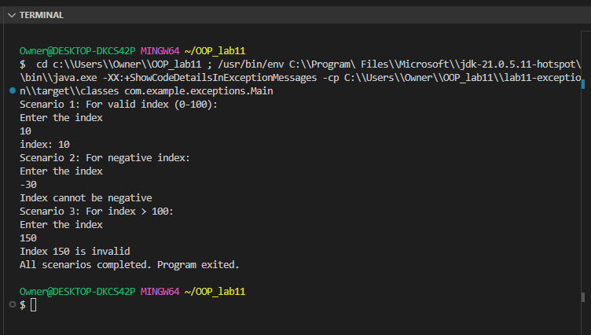

# Lab11-Exception

This project demonstrates exception handling in Java. It includes custom exception classes, validation logic, and unit tests.

## Project Structure

```
lab11-exception/
├── pom.xml
├── README.md
├── images/
│   └── screenshot1.png
├── src/
│   ├── main/
│   │   └── java/
│   │       └── com/
│   │           └── example/
│   │               └── exceptions/
│   │                   ├── IndexValidator.java
│   │                   ├── Main.java
│   │                   ├── MyException.java
│   │                   └── ScenarioHandler.java
│   └── test/
│       └── java/
│           └── com/
│               └── example/
│                   ├── AppTest.java
│                   └── IndexValidatorTest.java
└── target/
    ├── classes/
    │   └── com/
    │       └── example/
    │           └── exceptions/
    │               ├── IndexValidator.class
    │               ├── Main.class
    │               ├── MyException.class
    │               └── ScenarioHandler.class
    ├── generated-sources/
    │   └── annotations/
    ├── maven-status/
    │   └── maven-compiler-plugin/
    │       └── compile/
    │           ├── default-compile/
    │           │   ├── createdFiles.lst
    │           │   └── inputFiles.lst
    └── test-classes/
        └── com/
            └── example/
                └── exceptions/
                    ├── AppTest.class
                    └── IndexValidatorTest.class
```

## Major Classes and Files

- **[IndexValidator.java](lab11-exception/src/main/java/com/example/exceptions/IndexValidator.java)**: Contains methods for validating indices and returning positions.
- **[Main.java](lab11-exception/src/main/java/com/example/exceptions/Main.java)**: Entry point of the application, orchestrates scenario handling.
- **[MyException.java](lab11-exception/src/main/java/com/example/exceptions/MyException.java)**: Custom exception class for handling specific error scenarios.
- **[ScenarioHandler.java](lab11-exception/src/main/java/com/example/exceptions/ScenarioHandler.java)**: Provides structured methods to handle different scenarios interactively.
- **[AppTest.java](lab11-exception/src/test/java/com/example/exceptions/AppTest.java)**: Unit tests for the `ScenarioHandler` class.
- **[IndexValidatorTest.java](lab11-exception/src/test/java/com/example/exceptions/IndexValidatorTest.java)**: Unit tests for the `IndexValidator` class.

## Output Image

The output of the application is demonstrated in the following image:



## Synopsis

This project is designed to demonstrate the following:

1. **Custom Exception Handling**: The `MyException` class is a custom exception used to handle specific error scenarios.
2. **Validation Logic**: The `IndexValidator` class includes methods to validate indices and return positions.
3. **Scenario Handling**: The `ScenarioHandler` class provides a structured way to handle different scenarios interactively.
4. **Unit Testing**: The `AppTest` and `IndexValidatorTest` classes ensure the correctness of the implemented logic using JUnit.

